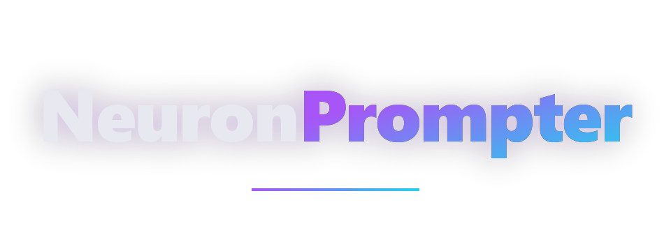

[](LICENSE)
[](https://github.com/FF-TEC/NeuronPrompter/actions/workflows/ci.yml)
[](Cargo.toml)

<p align="center">
  
</p>

<p align="center">
  <code>Rust / Single Binary / Local-First / MCP-Native / Ollama-Powered</code>
</p>

<h3 align="center">Your Workflow. Your Machine. Your Prompts.</h3>

---

NeuronPrompter is a multi-user AI prompt management tool that organizes
prompts, scripts, and chains into a searchable, version-controlled library.
No cloud. No API keys (beyond optional Ollama). Your data stays on your machine
in a local SQLite database.

Written in Rust, it ships as a single binary for Windows, macOS, and Linux.
A SolidJS web frontend with 8 tabs provides the UI, while 94 REST API
endpoints and 23 MCP tools allow Claude Code, Claude Desktop App, and custom
automation to manage prompts programmatically. Ollama integration adds
AI-powered prompt improvement, translation, and metadata derivation -- all
running locally.

---

## Table of Contents

- [Why NeuronPrompter](#why-neuronprompter)
- [Quick Start](#quick-start)
- [Screenshots](#screenshots)
- [Features](#features)
- [Installation](#installation)
- [Usage](#usage)
- [Architecture](#architecture)
- [Hardware Requirements](#hardware-requirements)
- [Documentation](#documentation)
- [Contributing](#contributing)
- [Security](#security)
- [License](#license)

---

## Why NeuronPrompter

**Local-First Data Ownership** -- All data is stored in a local SQLite database.
No cloud accounts, no telemetry, no tracking. Network access is only used for
Ollama LLM features (localhost by default). The application runs entirely
offline when Ollama features are not used.

**Structured Prompt Engineering** -- Prompts, scripts, and chains with version
control, template variables (`{{var}}`), taxonomy organization (tags,
categories, collections), full-text search (FTS5), and import/export in JSON
and Markdown formats. Every content change creates an immutable version
snapshot that can be compared and restored.

**AI-Native Architecture** -- 7 Rust crates with clear separation of concerns.
23 MCP tools for Claude Code and Claude Desktop App, Ollama integration for
prompt improvement and translation, 94 REST API endpoints with session
authentication and rate limiting, and a complete CLI for automation. CPU-only
builds compile into a single executable that runs without Docker, Kubernetes,
or external infrastructure.

---

## Quick Start

**1.** Download the binary for your platform from the
[Releases](https://github.com/FF-TEC/NeuronPrompter/releases) page.

**2.** Double-click the binary. The application opens in a native window
(WebView2 on Windows, WebKit on macOS) -- no terminal, no configuration
required. Linux opens the default browser automatically.

**3.** Create a user in the **Users** tab and start managing prompts.

> **Terminal alternative:** Run `neuronprompter serve --port 3030` for a
> headless API server without the GUI.

---

## Screenshots

> Screenshots of the web frontend are planned for a future update.

---

## Features

### Prompt Management

- Create, read, update, and delete prompts with title, content, description,
  notes, and ISO 639-1 language code
- Template variables (`{{variable_name}}`) with extraction and substitution
  on copy
- Favorites and archiving for workflow organization
- Full-text search via SQLite FTS5 with BM25 ranking
- Version history with immutable snapshots on every change and restore
  capability
- Duplicate and copy-to-user operations across user namespaces

### Script Management

- Same feature set as prompts with an additional required `script_language`
  field (python, bash, javascript, etc.)
- File system sync from local Markdown files with YAML frontmatter
- Version history identical to prompts

### Chains

- Compose ordered sequences of prompts and/or scripts with custom separators
- Mixed step types: each step references either a prompt or a script
- Content dynamically composed from referenced items (live references, not
  copies)
- Variable resolution across composed chain output

### Taxonomy

- **Tags** -- free-form labels for cross-cutting organization
- **Categories** -- semantic groupings (e.g., "Translation", "Summarization")
- **Collections** -- user-defined sets (folders/playlists)
- Per-user name uniqueness (case-insensitive)
- Many-to-many relationships with prompts, scripts, and chains
- Bulk assignment and filtering operations

### Multi-User Support

- Session-based authentication with 256-bit tokens
- User switching with complete content isolation
- Cross-user content copying (individual and bulk) with automatic taxonomy
  resolution and title conflict handling
- Per-user settings (theme, sort preferences, Ollama configuration)

### Ollama Integration

- **Improve** -- refine and rewrite prompts via a local LLM
- **Translate** -- translate prompt content to any target language
- **Metadata** -- derive title, tags, and description from prompt content
- Model management: list, pull, delete, and select models
- Per-user Ollama URL and model configuration
- Connection health check with cached model list

### Import / Export

- **JSON format** -- full-fidelity round-trip export and import of prompts,
  scripts, chains, and all taxonomy associations
- **Markdown format** -- individual files with YAML frontmatter containing
  title, description, language, tags, categories, and collections
- **Database backup** -- timestamped SQLite file copies to a backup directory
- Batch import up to 10,000 files with automatic taxonomy creation

### Web Frontend (8 Tabs)

The SolidJS single-page application is compiled into the binary via rust-embed
and served at `http://localhost:3030`.

| Tab | Function |
|-----|----------|
| **Prompts** | Prompt list with search and filter, split-pane editor, version history, template variable extraction and substitution |
| **Scripts** | Script list with language selection, editor, file system sync, Markdown import |
| **Chains** | Chain builder with step reordering, mixed prompt/script steps, separator configuration, composed content preview |
| **Organize** | Tag, category, and collection management with bulk operations across all entity types |
| **Models** | Ollama connection status, model selection for improve/translate/metadata, model pull and delete with SSE progress |
| **Settings** | Theme (light/dark/system), sort preferences, Ollama URL configuration, real-time log streaming via SSE |
| **Users** | User creation, profile editing, session info, user switching |
| **Clipboard** | Copy history with timestamps (50 entries per user), template variable substitution tracking |

### MCP Server (23 Tools)

The Model Context Protocol server exposes 23 tools for AI agent integration via
JSON-RPC 2.0 over stdio, organized in 6 categories:

| Category | Tools | Purpose |
|----------|-------|---------|
| Prompts | 5 | List, search, get, create, update prompts |
| Scripts | 5 | List, search, get, create, update scripts |
| Chains | 8 | List, search, get, get composed content, create, update, find references, duplicate |
| Tags | 2 | List, create tags |
| Categories | 2 | List, create categories |
| Collections | 1 | List collections |

All MCP operations are scoped to a dedicated `mcp_agent` user. Delete
operations and Ollama tools are excluded from the MCP surface.

### REST API (94 Endpoints)

Axum-based HTTP server with session-based authentication (256-bit tokens via HttpOnly
cookies), per-IP rate limiting (120 requests per 60 seconds), CORS, and
Server-Sent Events for real-time log and model operation streaming.

Endpoint categories: sessions, users, prompts, scripts, chains, tags,
categories, collections, versions, search, clipboard, import/export, backup,
settings, Ollama (status, improve, translate, metadata, model management),
health, and shutdown.

---

## Installation

### Pre-built Binaries

Download the binary for your platform from the
[Releases](https://github.com/FF-TEC/NeuronPrompter/releases) page.
Each release includes SHA-256 checksums for verification.

| Platform | Architecture | GUI | Artifact |
|----------|-------------|-----|----------|
| Windows | x86_64 | Native window (WebView2) | `neuronprompter-windows-x64.exe` |
| Linux | x86_64 | Opens in default browser | `neuronprompter-linux-x64` |
| Linux | x86_64 | Browser-only (headless) | `neuronprompter-linux-x64-server` |
| Linux | ARM64 | Browser-only (headless) | `neuronprompter-linux-arm64` |
| macOS | ARM64 (Apple Silicon) | Native window (WebKit) | `neuronprompter-macos-arm64` |
| macOS | x86_64 (Intel) | Native window (WebKit) | `neuronprompter-macos-x64` |

Linux GUI variants require `libwebkit2gtk-4.1-0` at runtime.
Server variants have zero runtime dependencies beyond glibc.

### From Source

Prerequisites: Rust 1.88+ (stable), Node 22+, npm.

On Linux (Debian/Ubuntu), install native build dependencies first:

```bash
sudo apt install libwebkit2gtk-4.1-dev libgtk-3-dev libayatana-appindicator3-dev librsvg2-dev
```

```bash
git clone https://github.com/FF-TEC/NeuronPrompter.git
cd NeuronPrompter

# Build the SolidJS frontend
cd crates/neuronprompter-web/frontend && npm ci && npm run build && cd ../../..

# Build the Rust binary (all features enabled by default)
cargo build --release -p neuronprompter
```

The binary is at `target/release/neuronprompter` (Linux/macOS) or
`target/release/neuronprompter.exe` (Windows).

For a server-only build without native GUI:

```bash
cargo build --release -p neuronprompter \
  --no-default-features \
  --features web,mcp
```

---

## Usage

### Web UI

```bash
neuronprompter
# or explicitly:
neuronprompter web --port 3030
```

Starts the API server and opens the SolidJS web frontend in a native window
(WebView2 on Windows, WebKit on macOS). Falls back to the default browser
on Linux or if the native window cannot be created. The frontend is served at
`http://localhost:3030`. If port 3030 is occupied, the server automatically
tries ports 3031 through 3049.

### Headless Server

```bash
neuronprompter serve --port 3030 --bind 0.0.0.0
```

Runs the REST API without opening a browser or native window. Suitable for
remote servers and automation.

### MCP Server (Claude Code & Claude Desktop App)

```bash
neuronprompter mcp install                        # registers in Claude Code settings (default)
neuronprompter mcp install --target claude-desktop # registers in Claude Desktop App settings
neuronprompter mcp uninstall                      # removes registration from Claude Code settings
neuronprompter mcp status                         # shows current registration status
neuronprompter mcp serve                          # starts stdio JSON-RPC server
```

### All Commands

| Command | Description |
|---------|-------------|
| `neuronprompter` / `neuronprompter web` | Launch web UI in a native window (browser fallback) |
| `neuronprompter serve` | Headless API server |
| `neuronprompter mcp install\|uninstall\|serve\|status` | Register, remove, run, and check MCP server |
| `neuronprompter version` | Print version |

---

## Architecture

```
User Input (Browser / MCP Client / REST API)
       |
       v
  Presentation Layer
  (REST API via Axum / MCP Server via stdio / Web UI via rust-embed)
       |
       v
  Application Service Layer
  (business logic, validation, Ollama client)
       |
       v
  Database Layer
  (SQLite with r2d2 connection pool, FTS5 full-text search)
       |
       v
  Stored: Prompts, Scripts, Chains, Versions,
  Tags, Categories, Collections, Users, Settings
```

### Cargo Workspace (7 Crates)

| Layer | Crate | Responsibility |
|-------|-------|---------------|
| Binary | `neuronprompter` | Entry point, CLI argument parsing (clap), execution mode dispatch |
| Presentation | `neuronprompter-web` | SolidJS frontend (rust-embed), native GUI (tao/wry), SSE broadcast |
| Presentation | `neuronprompter-api` | REST API server (Axum), 94 endpoints, session auth, rate limiting, CORS |
| Presentation | `neuronprompter-mcp` | MCP server (23 tools, JSON-RPC 2.0 over stdio) |
| Domain | `neuronprompter-application` | Service layer with business logic, Ollama HTTP client, import/export |
| Core | `neuronprompter-db` | SQLite storage (r2d2 pool), migrations, repository pattern, FTS5 search |
| Foundation | `neuronprompter-core` | Shared types, domain models, validation, error types, constants |

### Feature Flags

| Flag | Purpose | Default |
|------|---------|---------|
| `web` | SolidJS frontend embedded via rust-embed | Enabled |
| `gui` | Native window via tao/wry (requires `web`) | Enabled |
| `mcp` | Model Context Protocol server for AI agent integration | Enabled |

For the full architecture document, see [docs/architecture/architecture.pdf](docs/architecture/architecture.pdf).

---

## Hardware Requirements

| Component | Minimum | Recommended |
|-----------|---------|-------------|
| RAM | 256 MB | 512 MB+ |
| CPU | 1 core | 2+ cores |
| Disk | 50 MB (binary) + database size | 100 MB+ |

NeuronPrompter has no GPU requirements. Ollama runs as a separate process with
its own resource needs. The application runs entirely offline when Ollama
features are not used.

---

## Documentation

- [neuronprompter.com](https://neuronprompter.com) -- Project website with feature overview
- [Architecture Document](docs/architecture/architecture.pdf) -- System design (7 crates, data flow, design decisions)
- [REST API Reference](docs/api-reference.md) -- All 94 endpoints with method, path, and description
- [Test Plan](tests/TESTPLAN.md) -- Test coverage and verification strategy
- [Changelog](CHANGELOG.md) -- Release history and notable changes

---

## Contributing

Contributions are welcome. See [CONTRIBUTING.md](CONTRIBUTING.md) for
development setup, code style guidelines, testing instructions, and the pull
request process.

Please read the [Code of Conduct](CODE_OF_CONDUCT.md) before participating.

---

## Security

To report a vulnerability, see [SECURITY.md](SECURITY.md) for the disclosure
process and response timeline.

---

## License

NeuronPrompter is dual-licensed under your choice of:

- **MIT License** -- See [LICENSE](LICENSE)
- **Apache License 2.0** -- See [LICENSE-APACHE](LICENSE-APACHE)

You may choose either license at your option.

---

Copyright (C) 2026 Felix Fritz. All rights reserved.
